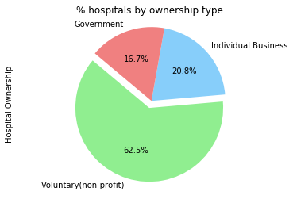
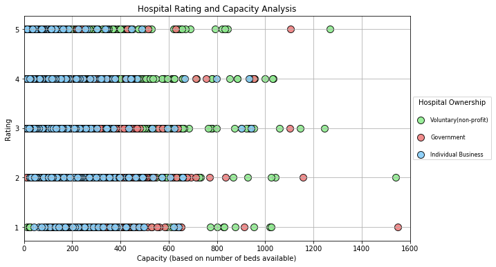
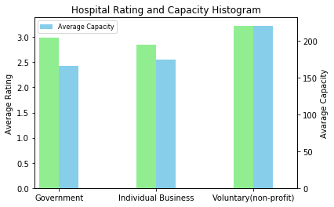

### Observations:
##### Majority of the hospitals are run by non-profit organizations, who has the highest average capacity and ratings. 

##### Majority of non-profit has a 4 stars rating

##### Majority of individual own has a 2 stars rating

##### Marity of government own has a 3 stars rating  


```python
import pandas as pd
import numpy as np
import matplotlib.pyplot as plt

data = pd.read_csv("DRG_hospital_rating_ownertype.csv",encoding='mac_roman')  #for csv files that from a mac computer
data2 =pd.read_csv("LH_merged_withbedcount.csv",encoding='mac_roman')  #for csv files that from a mac computer
```


```python
#selecting columns i care about, i don't know why theres two beds. I cleaned it later tho. 
data1 = data[['Provider Id','Provider Name','Hospital Type', 'Hospital Ownership', 'Hospital overall rating']]
data2 = data2[['Provider Id', 'Provider Name','BEDS', 'BEDS']]
```


```python
df = pd.merge(data1, data2, how=  "inner", on = 'Provider Id') #merge two data together 
```


```python
df = df.iloc[:,:-1] #delet the duplicate "BEDS" columns
```


```python
df = df.drop(['Provider Name_y', 'Hospital Type'], axis =1) #delete more columns

```


```python
df = df.rename(columns={'Provider Name_x':'Provider name'}) #cleaning data
```


```python
df.columns
```


    Index(['Provider Id', 'Provider name', 'Hospital Ownership',
           'Hospital overall rating', 'BEDS'],
          dtype='object')


```python
df =df.drop_duplicates() #cleaning up duplicated rows 
```


```python
df["Hospital Ownership"].value_counts()
```


    Voluntary non-profit - Private                 969
    Proprietary                                    463
    Voluntary non-profit - Other                   258
    Voluntary non-profit - Church                  241
    Government - Hospital District or Authority    220
    Government - Local                             141
    Physician                                       26
    Government - State                              22
    Government - Federal                             9
    Name: Hospital Ownership, dtype: int64


```python
df["Hospital Ownership"].unique()
```


    array(['Government - Hospital District or Authority',
           'Voluntary non-profit - Private', 'Government - State',
           'Proprietary', 'Voluntary non-profit - Church',
           'Voluntary non-profit - Other', 'Government - Local', 'Physician',
           'Government - Federal'], dtype=object)


```python
#grouping catagory into Hospital ownership: Voluntary(non-profit), Government, Individual business
df["Hospital Ownership"] = df["Hospital Ownership"].replace({
    'Voluntary non-profit - Private':'Voluntary(non-profit)',
    'Voluntary non-profit - Church':'Voluntary(non-profit)',
    'Voluntary non-profit - Other':'Voluntary(non-profit)', 
    'Government - Hospital District or Authority': 'Government',
    'Government - State': 'Government',
    'Government - Local': 'Government',
    'Government - Federal': 'Government',
    'Proprietary': 'Individual Business',
     'Physician': 'Individual Business'
                                 
                                 })
```


```python
df =df.reset_index()
df.head()
```


<div>
<style>
    .dataframe thead tr:only-child th {
        text-align: right;
    }

    .dataframe thead th {
        text-align: left;
    }

    .dataframe tbody tr th {
        vertical-align: top;
    }
</style>
<table border="1" class="dataframe">
  <thead>
    <tr style="text-align: right;">
      <th></th>
      <th>index</th>
      <th>Provider Id</th>
      <th>Provider name</th>
      <th>Hospital Ownership</th>
      <th>Hospital overall rating</th>
      <th>BEDS</th>
    </tr>
  </thead>
  <tbody>
    <tr>
      <th>0</th>
      <td>0</td>
      <td>10001</td>
      <td>SOUTHEAST ALABAMA MEDICAL CENTER</td>
      <td>Government</td>
      <td>3</td>
      <td>420.0</td>
    </tr>
    <tr>
      <th>1</th>
      <td>8464</td>
      <td>10005</td>
      <td>MARSHALL MEDICAL CENTER SOUTH</td>
      <td>Government</td>
      <td>2</td>
      <td>150.0</td>
    </tr>
    <tr>
      <th>2</th>
      <td>10865</td>
      <td>10006</td>
      <td>ELIZA COFFEE MEMORIAL HOSPITAL</td>
      <td>Government</td>
      <td>2</td>
      <td>328.0</td>
    </tr>
    <tr>
      <th>3</th>
      <td>18261</td>
      <td>10016</td>
      <td>SHELBY BAPTIST MEDICAL CENTER</td>
      <td>Voluntary(non-profit)</td>
      <td>3</td>
      <td>252.0</td>
    </tr>
    <tr>
      <th>4</th>
      <td>24661</td>
      <td>10023</td>
      <td>BAPTIST MEDICAL CENTER SOUTH</td>
      <td>Government</td>
      <td>3</td>
      <td>226.0</td>
    </tr>
  </tbody>
</table>
</div>


```python
#cleaned data ready for export
df.to_csv("data with provider id_name_hospitalownershipgrouped_rating_BEDS.csv")
```


```python
df["Hospital Ownership"].value_counts()
```


    Voluntary(non-profit)    1468
    Individual Business       489
    Government                392
    Name: Hospital Ownership, dtype: int64


```python
#ploting the percentage of hospitital ownership
df["Hospital Ownership"].value_counts(normalize= True).plot(
    kind = "pie",
    explode=[0.1,0,0],
    colors=["lightgreen", "lightskyblue", "lightcoral"],
    autopct="%1.1f%%",
    shadow=False, 
    startangle=140)
plt.title("% hospitals by ownership type")
plt.axis("equal") 

# plt.savefig("hospitals by ownership type.png")
plt.show()
plt.show()
```





```python
#Voluntary information
voluntary_capacity = df.loc[df["Hospital Ownership"]=='Voluntary(non-profit)', 'BEDS']
voluntary_rating= df.loc[df["Hospital Ownership"]=='Voluntary(non-profit)', 'Hospital overall rating']
voluntary_color = "lightgreen"


#Government information
gov_capacity = df.loc[df["Hospital Ownership"]=='Government', 'BEDS']
gov_rating= df.loc[df["Hospital Ownership"]=='Government', 'Hospital overall rating']
gov_color = "lightcoral"


#Individual BUsiness
indvidual_capacity = df.loc[df["Hospital Ownership"]=='Individual Business', 'BEDS']
indvidual_rating= df.loc[df["Hospital Ownership"]=='Individual Business', 'Hospital overall rating']
indvidual_color = "lightskyblue"

```


```python
#set figure size before plotting
plt.figure(figsize=(10,6))

#plotting
plt.scatter(x = voluntary_capacity, y =voluntary_rating, s = 100,
             alpha = 0.9, c = voluntary_color , label='Voluntary(non-profit)',
            edgecolor="black", linewidths=1)
plt.scatter(x = gov_capacity, y =gov_rating, s = 100,
             alpha = 0.9, c = gov_color , label='Government',
            edgecolor="black", linewidths=1)
plt.scatter(x = indvidual_capacity, y =indvidual_rating, s = 100,
             alpha = 0.9, c = indvidual_color , label='Individual Business',
            edgecolor="black", linewidths=1)

# adding stuff
plt.title("Hospital Rating and Capacity Analysis")
plt.ylabel("Rating")
plt.xlabel("Capacity (based on number of beds available)")
plt.xlim(0,1600)
plt.grid(True)
plt.legend(loc='center left', bbox_to_anchor=(1, 0.5), fontsize=8, title="Hospital Ownership" , labelspacing = 2)

plt.show()
```





```python
#hospital_ownsership_summary
hospital_ownsership_summary = df.groupby('Hospital Ownership')['BEDS','Hospital overall rating'].mean()
hospital_ownsership_summary
```


<div>
<style>
    .dataframe thead tr:only-child th {
        text-align: right;
    }

    .dataframe thead th {
        text-align: left;
    }

    .dataframe tbody tr th {
        vertical-align: top;
    }
</style>
<table border="1" class="dataframe">
  <thead>
    <tr style="text-align: right;">
      <th></th>
      <th>BEDS</th>
      <th>Hospital overall rating</th>
    </tr>
    <tr>
      <th>Hospital Ownership</th>
      <th></th>
      <th></th>
    </tr>
  </thead>
  <tbody>
    <tr>
      <th>Government</th>
      <td>165.211735</td>
      <td>2.984694</td>
    </tr>
    <tr>
      <th>Individual Business</th>
      <td>174.182004</td>
      <td>2.848671</td>
    </tr>
    <tr>
      <th>Voluntary(non-profit)</th>
      <td>220.245913</td>
      <td>3.226839</td>
    </tr>
  </tbody>
</table>
</div>


```python
# Bar Graph Version
fig = plt.figure() # Create matplotlib figure

ax = fig.add_subplot(111) # Create matplotlib axes
ax2 = ax.twinx() # Create another axes that shares the same x-axis as ax.

width = 0.2

df.groupby('Hospital Ownership')['Hospital overall rating'].mean().plot(
    kind='bar', color='lightgreen', ax=ax, width=width, position=1, label="Average Rating",rot=0)
df.groupby('Hospital Ownership')['BEDS'].mean().plot(
    kind='bar', color='skyblue', ax=ax2, width=width, position=0, label = "Average Capacity",rot=0)

plt.title("Hospital Rating and Capacity Histogram")

ax.set_ylabel('Average Rating')
ax2.set_ylabel('Avarage Capacity')
ax.set_xlabel("")
plt.legend(loc='best',  fontsize=8, labelspacing = 2)


plt.show()


```





```python
df.loc[df['Hospital overall rating']== 5, 'Hospital Ownership'].value_counts()
```


    Voluntary(non-profit)    180
    Individual Business       50
    Government                17
    Name: Hospital Ownership, dtype: int64


```python
df.loc[df['Hospital overall rating']== 4, 'Hospital Ownership'].value_counts()
```


    Voluntary(non-profit)    475
    Government               107
    Individual Business       95
    Name: Hospital Ownership, dtype: int64


```python
df.loc[df['Hospital overall rating']== 3, 'Hospital Ownership'].value_counts()
```


    Voluntary(non-profit)    419
    Government               154
    Individual Business      126
    Name: Hospital Ownership, dtype: int64


```python
df.loc[df['Hospital overall rating']== 2, 'Hospital Ownership'].value_counts()
```


    Voluntary(non-profit)    286
    Individual Business      167
    Government                81
    Name: Hospital Ownership, dtype: int64


```python
df.loc[df['Hospital overall rating']== 1, 'Hospital Ownership'].value_counts()
```


    Voluntary(non-profit)    108
    Individual Business       51
    Government                33
    Name: Hospital Ownership, dtype: int64


```python

```


    'C:\\Users\\SSF\\Desktop\\my work on project'


