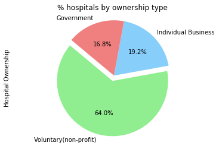
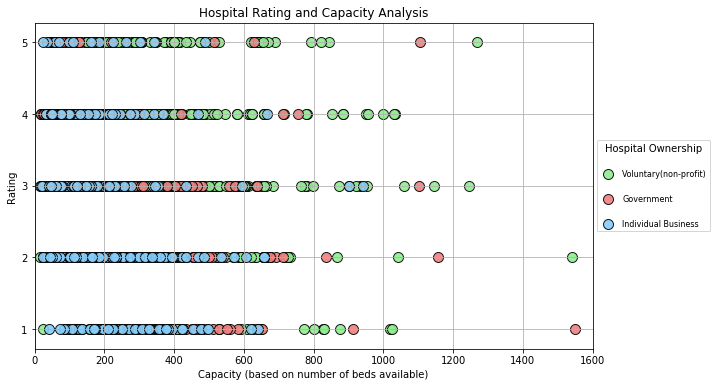
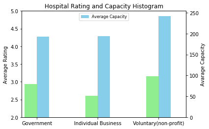

```python
import pandas as pd
import numpy as np
import matplotlib.pyplot as plt
import plotly as py
from pprint import pprint
import requests
import json
from plotly import __version__
from plotly.offline import download_plotlyjs, init_notebook_mode, plot, iplot
import plotly.graph_objs as go

py.offline.init_notebook_mode(connected=True)

from config import api_key
df = pd.read_csv("main_cleaned.csv") #main data without coordinates
sdf = pd.read_csv("USA costs with latlon.csv") #harry's data
```


<script>requirejs.config({paths: { 'plotly': ['https://cdn.plot.ly/plotly-latest.min']},});if(!window.Plotly) {{require(['plotly'],function(plotly) {window.Plotly=plotly;});}}</script>


```python
#cleaning up unnamed columns
df = df[[ 'Provider Id', 'Provider City', 'Provider Street Address',
       'Provider State', 'Provider name', 'Hospital Ownership',
       'Hospital overall rating', ' Average Total Payments ',
       'Average Medicare Payments', 'BEDS', 'Cost']]


#creating a new series that contains the location for each hospital
df['location'] = df['Provider Street Address'] + ", " + df['Provider City'] + ", " + df['Provider State']

#choose the column I want from Harry's data
sdf =sdf [['Provider Id',  'Latitude',
       'Longitude']]


#marged to main data
df = pd.merge(df,sdf, on = "Provider Id",how = "inner" )


#clean up
df = df.drop_duplicates(subset = 'Longitude') #this clean up any bad coordinates


#save the lat/lon data to main_csv
df.to_csv("main_cleaned.csv")
```


```python
df.head()
```


<div>
<style>
    .dataframe thead tr:only-child th {
        text-align: right;
    }

    .dataframe thead th {
        text-align: left;
    }

    .dataframe tbody tr th {
        vertical-align: top;
    }
</style>
<table border="1" class="dataframe">
  <thead>
    <tr style="text-align: right;">
      <th></th>
      <th>Provider Id</th>
      <th>Provider City</th>
      <th>Provider Street Address</th>
      <th>Provider State</th>
      <th>Provider name</th>
      <th>Hospital Ownership</th>
      <th>Hospital overall rating</th>
      <th>Average Total Payments</th>
      <th>Average Medicare Payments</th>
      <th>BEDS</th>
      <th>Cost</th>
      <th>location</th>
      <th>Latitude</th>
      <th>Longitude</th>
    </tr>
  </thead>
  <tbody>
    <tr>
      <th>0</th>
      <td>10001</td>
      <td>DOTHAN</td>
      <td>1108 ROSS CLARK CIRCLE</td>
      <td>AL</td>
      <td>SOUTHEAST ALABAMA MEDICAL CENTER</td>
      <td>Government</td>
      <td>3</td>
      <td>5777.24</td>
      <td>4763.73</td>
      <td>420.0</td>
      <td>1013.51</td>
      <td>1108 ROSS CLARK CIRCLE, DOTHAN, AL</td>
      <td>31.215884</td>
      <td>-85.363008</td>
    </tr>
    <tr>
      <th>1</th>
      <td>10005</td>
      <td>BOAZ</td>
      <td>2505 U S HIGHWAY 431 NORTH</td>
      <td>AL</td>
      <td>MARSHALL MEDICAL CENTER SOUTH</td>
      <td>Government</td>
      <td>2</td>
      <td>5787.57</td>
      <td>4976.71</td>
      <td>150.0</td>
      <td>810.86</td>
      <td>2505 U S HIGHWAY 431 NORTH, BOAZ, AL</td>
      <td>34.221590</td>
      <td>-86.160495</td>
    </tr>
    <tr>
      <th>2</th>
      <td>10006</td>
      <td>FLORENCE</td>
      <td>205 MARENGO STREET</td>
      <td>AL</td>
      <td>ELIZA COFFEE MEMORIAL HOSPITAL</td>
      <td>Government</td>
      <td>2</td>
      <td>5434.95</td>
      <td>4453.79</td>
      <td>328.0</td>
      <td>981.16</td>
      <td>205 MARENGO STREET, FLORENCE, AL</td>
      <td>34.793962</td>
      <td>-87.682691</td>
    </tr>
    <tr>
      <th>3</th>
      <td>10016</td>
      <td>ALABASTER</td>
      <td>1000 FIRST STREET NORTH</td>
      <td>AL</td>
      <td>SHELBY BAPTIST MEDICAL CENTER</td>
      <td>Voluntary(non-profit)</td>
      <td>3</td>
      <td>5658.33</td>
      <td>4851.44</td>
      <td>252.0</td>
      <td>806.89</td>
      <td>1000 FIRST STREET NORTH, ALABASTER, AL</td>
      <td>33.252414</td>
      <td>-86.813044</td>
    </tr>
    <tr>
      <th>4</th>
      <td>10023</td>
      <td>MONTGOMERY</td>
      <td>2105 EAST SOUTH BOULEVARD</td>
      <td>AL</td>
      <td>BAPTIST MEDICAL CENTER SOUTH</td>
      <td>Government</td>
      <td>3</td>
      <td>6653.80</td>
      <td>5374.14</td>
      <td>226.0</td>
      <td>1279.66</td>
      <td>2105 EAST SOUTH BOULEVARD, MONTGOMERY, AL</td>
      <td>32.326946</td>
      <td>-86.271034</td>
    </tr>
  </tbody>
</table>
</div>


```python
#ploting the percentage of hospitital ownership
df["Hospital Ownership"].value_counts(normalize= True).plot(
    kind = "pie",
    explode=[0.1,0,0],
    colors=["lightgreen", "lightskyblue", "lightcoral"],
    autopct="%1.1f%%",
    shadow=False, 
    startangle=140)
plt.title("% hospitals by ownership type")
plt.axis("equal") 

# plt.savefig("hospitals by ownership type.png")
plt.show()
plt.show()
```





```python
#Voluntary information
voluntary_capacity = df.loc[df["Hospital Ownership"]=='Voluntary(non-profit)', 'BEDS']
voluntary_rating= df.loc[df["Hospital Ownership"]=='Voluntary(non-profit)', 'Hospital overall rating']
voluntary_color = "lightgreen"


#Government information
gov_capacity = df.loc[df["Hospital Ownership"]=='Government', 'BEDS']
gov_rating= df.loc[df["Hospital Ownership"]=='Government', 'Hospital overall rating']
gov_color = "lightcoral"


#Individual BUsiness
indvidual_capacity = df.loc[df["Hospital Ownership"]=='Individual Business', 'BEDS']
indvidual_rating= df.loc[df["Hospital Ownership"]=='Individual Business', 'Hospital overall rating']
indvidual_color = "lightskyblue"

```


```python
#set figure size before plotting
plt.figure(figsize=(10,6))

#plotting
plt.scatter(x = voluntary_capacity, y =voluntary_rating, s = 100,
             alpha = 0.9, c = voluntary_color , label='Voluntary(non-profit)',
            edgecolor="black", linewidths=1)
plt.scatter(x = gov_capacity, y =gov_rating, s = 100,
             alpha = 0.9, c = gov_color , label='Government',
            edgecolor="black", linewidths=1)
plt.scatter(x = indvidual_capacity, y =indvidual_rating, s = 100,
             alpha = 0.9, c = indvidual_color , label='Individual Business',
            edgecolor="black", linewidths=1)

# adding stuff
plt.title("Hospital Rating and Capacity Analysis")
plt.ylabel("Rating")
plt.xlabel("Capacity (based on number of beds available)")
plt.xlim(0,1600)
plt.grid(True)
plt.legend(loc='center left', bbox_to_anchor=(1, 0.5), fontsize=8, title="Hospital Ownership" , labelspacing = 2)

plt.show()
```





```python
#hospital_ownsership_summary
hospital_ownsership_summary = df.groupby('Hospital Ownership')['BEDS','Hospital overall rating'].mean()
hospital_ownsership_summary
```


<div>
<style>
    .dataframe thead tr:only-child th {
        text-align: right;
    }

    .dataframe thead th {
        text-align: left;
    }

    .dataframe tbody tr th {
        vertical-align: top;
    }
</style>
<table border="1" class="dataframe">
  <thead>
    <tr style="text-align: right;">
      <th></th>
      <th>BEDS</th>
      <th>Hospital overall rating</th>
    </tr>
    <tr>
      <th>Hospital Ownership</th>
      <th></th>
      <th></th>
    </tr>
  </thead>
  <tbody>
    <tr>
      <th>Government</th>
      <td>192.988189</td>
      <td>2.929134</td>
    </tr>
    <tr>
      <th>Individual Business</th>
      <td>193.910653</td>
      <td>2.597938</td>
    </tr>
    <tr>
      <th>Voluntary(non-profit)</th>
      <td>242.296488</td>
      <td>3.158058</td>
    </tr>
  </tbody>
</table>
</div>


```python
# Bar Graph Version
fig = plt.figure() # Create matplotlib figure

ax = fig.add_subplot(111) # Create matplotlib axes
ax2 = ax.twinx() # Create another axes that shares the same x-axis as ax.

width = 0.2

df.groupby('Hospital Ownership')['Hospital overall rating'].mean().plot(
    kind='bar', color='lightgreen', ax=ax, width=width, position=1, label="Average Rating",rot=0, ylim = (2,5))
df.groupby('Hospital Ownership')['BEDS'].mean().plot(
    kind='bar', color='skyblue', ax=ax2, width=width, position=0, label = "Average Capacity",rot=0)

plt.title("Hospital Rating and Capacity Histogram")

ax.set_ylabel('Average Rating')

ax2.set_ylabel('Avarage Capacity')
ax.set_xlabel("")
plt.legend(loc='upper center',  fontsize=8, labelspacing = 2)


plt.show()


```





```python
one  = df.loc[df['Hospital overall rating']== 1, 'Hospital Ownership'].value_counts().to_dict()
two  = df.loc[df['Hospital overall rating']== 2, 'Hospital Ownership'].value_counts().to_dict()
three  = df.loc[df['Hospital overall rating']== 3, 'Hospital Ownership'].value_counts().to_dict()
four = df.loc[df['Hospital overall rating']== 4, 'Hospital Ownership'].value_counts().to_dict()
five  = df.loc[df['Hospital overall rating']== 5, 'Hospital Ownership'].value_counts().to_dict()

```


```python
newdf = pd.DataFrame([one,two,three,four,five])
newdf["Rating"]=[1,2,3,4,5]
hospital_type_rating = newdf[['Rating','Government', 'Individual Business', 'Voluntary(non-profit)']]
hospital_type_rating
```


<div>
<style>
    .dataframe thead tr:only-child th {
        text-align: right;
    }

    .dataframe thead th {
        text-align: left;
    }

    .dataframe tbody tr th {
        vertical-align: top;
    }
</style>
<table border="1" class="dataframe">
  <thead>
    <tr style="text-align: right;">
      <th></th>
      <th>Rating</th>
      <th>Government</th>
      <th>Individual Business</th>
      <th>Voluntary(non-profit)</th>
    </tr>
  </thead>
  <tbody>
    <tr>
      <th>0</th>
      <td>1</td>
      <td>30</td>
      <td>44</td>
      <td>73</td>
    </tr>
    <tr>
      <th>1</th>
      <td>2</td>
      <td>53</td>
      <td>103</td>
      <td>201</td>
    </tr>
    <tr>
      <th>2</th>
      <td>3</td>
      <td>88</td>
      <td>84</td>
      <td>292</td>
    </tr>
    <tr>
      <th>3</th>
      <td>4</td>
      <td>71</td>
      <td>46</td>
      <td>304</td>
    </tr>
    <tr>
      <th>4</th>
      <td>5</td>
      <td>12</td>
      <td>14</td>
      <td>98</td>
    </tr>
  </tbody>
</table>
</div>


```python
df.groupby('Hospital Ownership')['Cost'].describe()
```


<div>
<style>
    .dataframe thead tr:only-child th {
        text-align: right;
    }

    .dataframe thead th {
        text-align: left;
    }

    .dataframe tbody tr th {
        vertical-align: top;
    }
</style>
<table border="1" class="dataframe">
  <thead>
    <tr style="text-align: right;">
      <th></th>
      <th>count</th>
      <th>mean</th>
      <th>std</th>
      <th>min</th>
      <th>25%</th>
      <th>50%</th>
      <th>75%</th>
      <th>max</th>
    </tr>
    <tr>
      <th>Hospital Ownership</th>
      <th></th>
      <th></th>
      <th></th>
      <th></th>
      <th></th>
      <th></th>
      <th></th>
      <th></th>
    </tr>
  </thead>
  <tbody>
    <tr>
      <th>Government</th>
      <td>254.0</td>
      <td>996.175748</td>
      <td>389.515585</td>
      <td>205.82</td>
      <td>797.4675</td>
      <td>926.18</td>
      <td>1040.0000</td>
      <td>3464.77</td>
    </tr>
    <tr>
      <th>Individual Business</th>
      <td>291.0</td>
      <td>1149.171649</td>
      <td>916.041661</td>
      <td>202.91</td>
      <td>816.7250</td>
      <td>943.16</td>
      <td>1155.8000</td>
      <td>10357.62</td>
    </tr>
    <tr>
      <th>Voluntary(non-profit)</th>
      <td>968.0</td>
      <td>1199.759277</td>
      <td>858.206359</td>
      <td>374.67</td>
      <td>830.6400</td>
      <td>958.86</td>
      <td>1261.6275</td>
      <td>14018.69</td>
    </tr>
  </tbody>
</table>
</div>


```python
df['Hospital Ownership'].unique()
```


    array(['Government', 'Voluntary(non-profit)', 'Individual Business'], dtype=object)


```python
# Visualization for cost, rating, capacity for all ownership type 
cost_graph = go.Bar(x =[df['Hospital Ownership'].unique()[0],df['Hospital Ownership'].unique()[2], df['Hospital Ownership'].unique()[1]], 
                    y = df.groupby('Hospital Ownership')['Cost'].mean(),
                   name = "Cost", 
                   marker=dict(
        color='#b2df8a',
        line=dict(
            color='rgb(8,48,107)',
            width=1),
        ))


capa_graph = go.Bar(x =[df['Hospital Ownership'].unique()[0],df['Hospital Ownership'].unique()[2], df['Hospital Ownership'].unique()[1]], 
                    y = df.groupby('Hospital Ownership')['BEDS'].mean(),
                   name = "Capacity",
                   marker=dict(
        color='#a6cee3',
        line=dict(
            color='rgb(8,48,107)',
            width=1),
        ))

rating_graph = go.Bar(x =[df['Hospital Ownership'].unique()[0],df['Hospital Ownership'].unique()[2], df['Hospital Ownership'].unique()[1]], 
                    y = df.groupby('Hospital Ownership')['Hospital overall rating'].mean()*100,
                   name = "Rating",
                   marker=dict(
        color='#1f78b4',
        line=dict(
            color='rgb(8,48,107)',
            width=1),
        ))
data = [cost_graph, capa_graph, rating_graph ]

updatemenus = list([
    dict(type="buttons", x = -0.3,
       
         buttons=list([   
            dict(label = 'Cost Comparison', 
                 method = 'update',  
                 args = [{'visible': [True, False, False]}, 
                         {'title': 'Cost(USD) vs Ownership Type'
                          }]),
            dict(label = 'Capacity Comparison',
                 method = 'update',
                 args = [{'visible': [False, True, False]}, 
                         {'title': 'Capacity(Number of Beds) vs Ownership Type'
                          }]),
            dict(label = 'Rating Comparison',
                 method = 'update', 
                 args = [{'visible': [False, False, True]}, 
                         {'title': 'Rating(Out of 500) vs Ownership Type',
                          }]),
             dict(label = 'Overall Comparison',
                 method = 'update', 
                 args = [{'visible': [True, True, True,True]},  
                         {'title': 'Overall Comparison'
                          }])

       
    
]))])


layout = dict( title ="Overall Comparison", showlegend=True,  width=600,
    height=400,updatemenus=updatemenus)

fig = dict(data=data, layout=layout)
py.offline.iplot(fig)

```


<div id="9d08470e-b8da-494f-8615-b5122ae612eb" style="height: 400px; width: 600px;" class="plotly-graph-div"></div><script type="text/javascript">require(["plotly"], function(Plotly) { window.PLOTLYENV=window.PLOTLYENV || {};window.PLOTLYENV.BASE_URL="https://plot.ly";Plotly.newPlot("9d08470e-b8da-494f-8615-b5122ae612eb", [{"type": "bar", "x": ["Government", "Individual Business", "Voluntary(non-profit)"], "y": [996.175748031496, 1149.1716494845366, 1199.759276859502], "name": "Cost", "marker": {"color": "#b2df8a", "line": {"color": "rgb(8,48,107)", "width": 1}}}, {"type": "bar", "x": ["Government", "Individual Business", "Voluntary(non-profit)"], "y": [192.98818897637796, 193.9106529209622, 242.2964876033058], "name": "Capacity", "marker": {"color": "#a6cee3", "line": {"color": "rgb(8,48,107)", "width": 1}}}, {"type": "bar", "x": ["Government", "Individual Business", "Voluntary(non-profit)"], "y": [292.9133858267717, 259.7938144329897, 315.8057851239669], "name": "Rating", "marker": {"color": "#1f78b4", "line": {"color": "rgb(8,48,107)", "width": 1}}}], {"title": "Overall Comparison", "showlegend": true, "width": 600, "height": 400, "updatemenus": [{"type": "buttons", "x": -0.3, "buttons": [{"label": "Cost Comparison", "method": "update", "args": [{"visible": [true, false, false]}, {"title": "Cost(USD) vs Ownership Type"}]}, {"label": "Capacity Comparison", "method": "update", "args": [{"visible": [false, true, false]}, {"title": "Capacity(Number of Beds) vs Ownership Type"}]}, {"label": "Rating Comparison", "method": "update", "args": [{"visible": [false, false, true]}, {"title": "Rating(Out of 500) vs Ownership Type"}]}, {"label": "Overall Comparison", "method": "update", "args": [{"visible": [true, true, true, true]}, {"title": "Overall Comparison"}]}]}]}, {"showLink": true, "linkText": "Export to plot.ly"})});</script>


```python
#Made this awesome geo scatter plot, WOOOT!
#input into plotly by scattergeo
gov = dict(type="scattergeo", locationmode="USA-states", name = df['Hospital Ownership'].unique()[0],
            text = df['Hospital Ownership'].unique()[0] , 
            lon = df.loc[df['Hospital Ownership']== df['Hospital Ownership'].unique()[0], 'Longitude'],
            lat = df.loc[df['Hospital Ownership']== df['Hospital Ownership'].unique()[0], 'Latitude'], 
             marker = dict(size=6, autocolorscale=True, colorscale='custom-colorscale',
            color = '#d7191c'))

vol = dict(type="scattergeo", locationmode="USA-states", name = df['Hospital Ownership'].unique()[1],
            text = df['Hospital Ownership'].unique()[1] , 
            lon = df.loc[df['Hospital Ownership']== df['Hospital Ownership'].unique()[1],'Longitude'],
            lat = df.loc[df['Hospital Ownership']== df['Hospital Ownership'].unique()[1], 'Latitude'], 
             marker = dict(size=6, autocolorscale=True, colorscale='custom-colorscale',
            color = '#fdae61'))

ind = dict(type="scattergeo", locationmode="USA-states", name = df['Hospital Ownership'].unique()[2],
            text = df['Hospital Ownership'].unique()[2] , 
            lon = df.loc[df['Hospital Ownership']== df['Hospital Ownership'].unique()[2], 'Longitude'],
            lat = df.loc[df['Hospital Ownership']== df['Hospital Ownership'].unique()[2], 'Latitude'], 
             marker = dict(size=6, autocolorscale=True, colorscale='custom-colorscale',
            color = '#2c7bb6'))

data = [gov,vol,ind]

layout = dict(title="Hospital Ownership Distribution in US", showlegend=True,
              geo = dict(scope='usa',projection = dict(type='albers usa'), 
                         showland=True, landcolor="#abd9e9"))

fig = dict(data=data, layout=layout)
py.offline.iplot(fig)
```


<div id="601e8f54-0c29-4bae-9088-94ab6d6c29f3" style="height: 525px; width: 100%;" class="plotly-graph-div"></div><script type="text/javascript">require(["plotly"], function(Plotly) { window.PLOTLYENV=window.PLOTLYENV || {};window.PLOTLYENV.BASE_URL="https://plot.ly";Plotly.newPlot("601e8f54-0c29-4bae-9088-94ab6d6c29f3", [{"type": "scattergeo", "locationmode": "USA-states", "name": "Government", "text": "Government", "lon": [-85.3630079, -86.160495, -87.6826906, -86.2710335, -86.8020205, -87.8883067, -112.48111259999999, -112.17958440000001, -119.2949582, -117.07582260000001, -117.29043590000002, -118.4465738, -122.07991170000001, -122.53603059999999, -116.9601303, -81.87408049999998, -81.0547222, -82.3358636, -80.824111, -80.17972089999998, -82.13890009999999, -82.531735, -80.39376429999999, -81.94324499999998, -84.1583522, -85.0744813, -83.81723620000001, -85.17920229999999, -83.63534320000001, -83.2863, -116.79320600000001, -89.69715529999998, -85.99320689999998, -86.0243936, -85.8954083, -91.5480726, -94.60896600000001, -85.87600090000001, -90.80542700000001, -90.7142147, -90.1817668, -95.0460933, -89.11534809999998, -88.5329127, -89.32952639999998, -93.2212098, -94.551452, -94.4243895, -106.63392040000001, -73.80606490000001, -78.7027257, -97.0681107, -83.61584409999998, -83.0178423, -98.436801, -124.233298, -79.946823, -81.939538, -85.2907565, -86.8748531, -122.1327937, -72.7969497, -80.21322090000001, -81.52765759999998, -80.30967640000001, -82.8634495, -83.49152409999998, -87.6705173, -86.17630439999998, -84.88342779999998, -93.6118077, -88.0445283, -90.1983228, -91.7853512, -73.55374979999998, -73.84637239999998, -73.8857803, -73.9650892, -73.94616959999998, -73.97669520000001, -73.8043186, -81.53684410000002, -77.38512539999998, -78.3343503, -80.5226194, -77.8530261, -87.69891109999998, -87.286024, -86.9906177, -86.1748296, -121.9332672, -115.56857099999999, -121.9797604, -122.4047381, -117.351059, -117.2051741, -117.19894640000001, -119.33849209999998, -117.05610060000001, -85.24189100000001, -81.48448590000001, -156.4893706, -155.11274619999998, -90.4185105, -85.8916328, -85.78092339999998, -95.24858370000001, -95.6393051, -86.04664220000001, -88.651384, -92.07525270000001, -84.9893546, -73.9425033, -78.32339300000001, -81.20107569999998, -83.840008, -85.82207919999998, -85.9449087, -87.675383, -87.47634889999998, -114.0370933, -93.2391848, -116.94614720000001, -122.4656876, -120.43951909999998, -119.2520998, -122.25349109999999, -116.27618490000002, -118.2081617, -124.19424690000001, -81.72143259999999, -80.3728387, -83.3489281, -83.53708859999998, -84.2554928, -83.9623541, -83.7812905, -82.3471716, -81.89171809999998, -84.55223620000001, -84.148048, -159.3644875, -90.343118, -87.67437109999999, -86.0768772, -86.50165, -85.3630575, -85.76770499999998, -86.36161899999998, -86.4731115, -95.14336970000001, -91.13751009999999, -91.9171756, -68.0082896, -85.64778220000001, -82.48089509999998, -95.376048, -88.82057859999998, -93.4200441, -96.4911158, -105.2107864, -73.94018729999998, -80.61189100000001, -81.15711440000001, -77.0730983, -81.93140129999998, -84.639426, -82.93623819999998, -99.3171146, -97.961299, -95.999694, -87.3206816, -108.04700000000001, -93.0515948, -86.228932, -93.7684297, -86.18666970000001, -121.3861055, -93.368672, -84.2462652, -91.034791, -97.364614, -95.3926399, -80.24554909999998, -95.2646156, -88.6343747, -74.9088519, -73.88104840000001, -95.4965439, -86.451938, -81.4485844, -85.632075, -94.2216421, -83.47090229999998, -81.8987728, -85.3378037, -92.1575962, -83.5094783, -89.3547281, -93.7224074, -88.089069, -82.87475189999998, -82.80425170000002, -83.17796330000002, -95.2673584, -101.90489170000001, -93.079163, -92.4173673, -92.1077483, -93.2890285, -91.7051799, -94.3605275, -108.26275559999999, -78.1306819, -81.91997479999998, -84.9167712, -85.1563565, -134.4649167, -121.63308870000002, -114.59507169999999, -111.7708611, -90.66577779999999, -100.9257873, -85.40740640000001, -90.6501158, -94.34075770000001, -74.06320649999998, -106.6771211, -94.78887, -97.2147038, -94.00850870000001, -85.48400059999999, -91.7491588, -89.1064866, -89.64227969999997, -83.36902990000002, -109.6076963, -96.851104, -95.7379518, -101.358531, -92.094571, -89.72918589999998, -108.7302705, -103.36197800000001, -96.4014553, -112.02611909999999, -109.0483992, -121.2826314, -155.9173862, -97.3927192, -97.038391, -108.6861275, -98.6709801, -97.2997278], "lat": [31.215884000000003, 34.22159, 34.7939615, 32.326946299999996, 33.5056591, 30.519026500000002, 34.559343299999995, 33.609194099999996, 36.328571999999994, 33.1248595, 33.1856484, 34.0664764, 37.369477200000006, 37.9473152, 33.7503708, 26.628409299999998, 29.2004452, 28.8338994, 28.6307029, 26.0189172, 29.1751787, 27.3185566, 27.658355699999998, 26.639437899999997, 31.5909075, 33.5696655, 34.3042219, 34.2595758, 32.8335837, 30.86249999999999, 47.695572799999994, 41.801587100000006, 41.6796028, 40.045545800000006, 39.2170557, 41.659487, 39.0558167, 37.7131105, 29.7810152, 29.597206099999998, 30.0130374, 45.1199948, 30.3667257, 30.3743855, 31.3185784, 38.6993942, 39.1495404, 39.2747471, 35.0821338, 41.086676000000004, 35.8179154, 47.9105352, 41.616690399999996, 39.9954221, 34.6092638, 43.385831, 32.784352, 34.9667602, 35.048200099999995, 34.207586600000006, 38.006764000000004, 41.73343029999999, 25.7923698, 28.549836100000004, 26.014047, 31.509616700000002, 31.4714885, 41.869310299999995, 39.7804315, 39.111381, 42.0328049, 45.8098407, 33.518252000000004, 37.95260510000001, 40.7261764, 40.8547222, 40.7450725, 40.5854106, 40.656719200000005, 40.7393956, 40.716848399999996, 35.3020407, 34.7629986, 35.51426560000001, 34.9755373, 35.976221, 34.7464821, 34.4828876, 33.3722775, 32.376228399999995, 37.31285689999999, 32.7804333, 37.55726, 37.7557265, 34.0740531, 34.036537200000005, 33.9102471, 36.22113289999999, 32.9964572, 30.786751000000002, 31.175415100000002, 20.8844128, 19.7182454, 41.4943265, 38.9558271, 39.5250652, 38.97893079999999, 37.040932399999996, 34.6617256, 36.7588002, 30.5447326, 41.9381529, 40.69968970000001, 35.008338, 35.48905140000001, 39.443587, 33.2774347, 31.781149699999997, 34.744969, 31.0166253, 35.2201547, 33.2742569, 33.9316874, 38.2881503, 34.6411375, 34.2769982, 37.762780600000006, 34.13268060000001, 34.0577573, 41.7736588, 28.5521875, 25.990886800000002, 34.5937302, 34.581043799999996, 32.0666637, 34.8858798, 31.9775657, 32.592759, 31.6018273, 30.9029469, 33.7058416, 21.9854096, 39.110403000000005, 41.87361689999999, 39.4795429, 39.76255, 39.943402, 39.794902, 40.763244, 40.0773255, 43.149637, 30.6490105, 32.7748904, 46.8796554, 41.9350848, 42.7852319, 45.873948399999996, 33.4758006, 37.6265369, 41.4533062, 35.6235778, 40.8142282, 36.488966999999995, 36.1587561, 35.839746000000005, 40.820910999999995, 40.480736, 39.610382200000004, 34.6369701, 35.04924099999999, 36.146746500000006, 31.498257000000002, 38.7453999, 41.70292020000001, 43.050816999999995, 38.3896149, 32.5523787, 36.8338985, 30.22981499999999, 44.26336209999999, 33.410986, 35.02885870000001, 35.961096399999995, 26.0296956, 37.32108849999999, 31.6733795, 44.9363044, 40.8804931, 34.012312, 32.463778000000005, 30.653144300000005, 31.451328000000004, 34.5891875, 34.2203324, 32.16619130000001, 37.3664276, 31.693821399999997, 44.2753275, 30.317229100000002, 38.765869, 33.274677000000004, 34.112518, 32.995780100000005, 32.185393100000006, 38.5965144, 37.002548499999996, 31.75285, 30.642206899999994, 29.973708000000002, 30.8419185, 32.1582404, 37.8309079, 32.795583799999996, 42.754247, 40.5651437, 33.744425299999996, 31.8887641, 58.32901640000001, 36.6966688, 33.612948100000004, 43.8257211, 40.447660600000006, 37.0542218, 41.794732200000006, 33.4572168, 38.249529200000005, 40.95692329999999, 35.207349799999996, 35.463441499999995, 34.7196376, 30.9078435, 33.307344199999996, 32.4632268, 32.7570462, 34.131415600000004, 40.2306914, 36.1575812, 39.0140681, 38.202416799999995, 37.584548999999996, 32.077444, 31.8711038, 35.50844779999999, 34.169133, 35.833816399999996, 33.4573098, 35.759316999999996, 37.8867135, 19.5199478, 37.2783428, 37.133018, 36.78445479999999, 36.7873678, 36.2884736], "marker": {"size": 6, "autocolorscale": true, "colorscale": "custom-colorscale", "color": "#d7191c"}}, {"type": "scattergeo", "locationmode": "USA-states", "name": "Voluntary(non-profit)", "text": "Voluntary(non-profit)", "lon": [-86.81304449999999, -88.19855229999999, -112.0579588, -112.02922099999999, -114.63491599999999, -111.64390729999998, -112.28422309999999, -111.87704109999999, 0.0, -94.1828963, -92.3944185, -92.4576613, -92.01767640000001, -90.66602359999999, -91.6343327, -124.14237859999999, -121.4536648, -117.86542450000002, -117.16038999999999, -120.4131853, -121.5942279, -118.1873236, -122.25466540000001, -117.93004679999999, -121.5709949, -120.6511558, -122.7075929, -119.0276426, -121.24922340000002, -121.6459423, -118.3434945, -119.72336010000001, -117.24247209999999, -118.152753, -122.1756787, -121.4546344, -117.70872469999999, -118.53204070000001, -104.7095264, -107.8255618, -104.61269399999999, -108.56270549999999, -104.82174499999999, -104.97481950000001, -104.99722109999999, -72.6984118, -73.16643619999998, -72.4504652, -73.0368663, -72.80114509999999, -73.630196, -72.64706389999998, -72.93556629999998, -72.0889953, -72.6791793, -73.20165349999998, -73.44628900000001, -73.420307, -75.1430456, -80.0697661, -81.79874679999998, -80.6143055, -87.21151520000002, -81.689871, -80.24354709999999, -82.18801490000001, -81.7247112, -81.714703, -81.10754859999999, -81.28480400000001, -82.49105209999998, -81.8683185, -81.66274949999998, -81.3171898, -87.23127530000001, -81.50995929999998, -81.18920859999999, -82.8028719, -82.45918470000001, -80.14541760000002, -81.4414608, -81.9546908, -80.10220129999998, -82.42233039999998, -81.7376226, -80.0964668, -82.53498979999998, -82.7075938, -81.9582652, -84.32219669999998, -81.98307170000001, -84.79531290000001, -84.55160649999999, -81.0894845, -83.97393170000001, -81.154752, -84.28282659999998, -84.3944183, -84.605051, -84.508624, -87.8417863, -87.68488, -89.59340329999998, -91.3983317, -88.269583, -88.91034959999999, -89.6451854, -87.8141447, -87.8863882, -89.5907819, -87.69828550000003, -88.27897689999998, -87.8144583, -87.66974859999998, -88.99069870000001, -88.9613543, -89.6567571, -88.95507190000001, -89.2202884, -88.93170440000002, -87.710796, -88.4008463, -90.0214907, -87.88308049999998, -89.9891536, -88.27400089999998, -87.65960729999998, -87.9527759, -87.7328532, -89.59499190000001, -88.34354509999999, -87.847611, -89.0738954, -88.15010529999998, -89.00732679999999, -89.09940639999998, -87.9936113, -88.0165099, -90.57066040000001, -87.6209858, -88.00808549999998, -88.1732844, -87.3577478, -85.7491194, -86.17949250000001, -86.9011441, -85.10164739999998, -87.40851070000001, -85.83054589999998, -87.2613291, -87.53294009999998, -85.83457539999998, -84.8838698, -86.54038249999998, -86.1641085, -86.25173259999998, -87.57125649999998, -85.41462840000001, -87.52442330000002, -87.50490200000002, -86.8344985, -86.940895, -87.5062531, -87.3675765, -86.13254599999998, -86.07858449999998, -86.8065232, -90.5565222, -91.66043220000002, -91.1730702, -93.21607, -90.6750809, -90.1892084, -93.63357579999999, -93.62288840000001, -97.6102357, -99.299245, -95.69591, -94.82402009999998, -94.7117298, -97.33235140000001, -94.6521061, -84.52370289999998, -86.4299604, -82.52612509999999, -84.7732703, -87.49554760000002, -88.6473046, -92.01952390000001, -90.0944039, -90.09234620000001, -93.1975818, -91.1070679, -70.27533319999999, -70.2145298, -68.7525715, -77.6851973, -77.03474870000001, -77.4146128, -76.67146939999998, -75.598013, -77.110582, -76.53419840000001, -78.7328124, -76.54683829999998, -75.832008, -76.99083459999999, -76.6247907, -76.88591699999998, -76.58727689999998, -71.27567320000001, -70.27483769999999, -70.907117, -71.3422768, -71.0688334, -72.6037013, -70.95412270000001, -71.2464373, -71.1067408, -71.06330799999998, -70.620817, -85.58041850000001, -86.47829490000001, -83.27602390000001, -85.66451359999998, -83.86818149999998, -83.72728819999998, -83.9384673, -85.64178570000001, -85.5615316, -83.73259499999998, -83.1476402, -83.65442709999998, -82.9149578, -83.0048137, -83.64232309999998, -84.26060840000001, -84.53518670000001, -85.72266859999998, -83.3147183, -83.1492553, -93.3224025, -94.16920470000001, -92.0876204, -93.2620166, -93.10002259999999, -93.3260119, -94.89942420000001, -93.09464770000001, -93.3709696, -88.56013170000001, -88.69754559999998, -89.366704, -88.69999849999998, -94.7710179, -91.45070799999999, -92.18171740000001, -92.315626, -94.6036175, -90.4341088, -90.44652, -90.50320440000002, -92.683012, -114.0000297, -114.3236774, -99.0818136, -96.00831070000001, -103.6642038, -97.4529737, -119.7952115, -119.8188283, -119.78476380000001, -71.56177790000001, -72.27298449999998, -71.4632103, -71.48030990000001, -71.4746693, -74.0565417, -74.17644870000001, -74.10069200000001, -74.4655683, -75.09492309999999, -74.5851859, -74.44984659999999, -74.2156583, -73.9686632, -74.59410729999998, -74.3526073, -74.1312932, -74.7949847, -73.98560119999998, -74.30476290000001, -74.31310450000001, -106.6399527, -73.93617270000001, -73.953689, -78.848085, -76.82794779999998, -73.70162839999998, -73.9607736, -77.58702190000001, -74.36809439999998, -74.92318630000003, -76.14950440000001, -73.64304489999998, -73.646615, -73.99847740000001, -73.706923, -73.6309928, -76.13833709999999, -73.9743316, -73.79762559999999, -73.9798349, -77.624972, -73.76966540000001, -78.9327441, -80.2714555, -79.01185229999999, -79.5031405, -78.61796600000001, -81.26728399999998, -100.7777559, -101.2877014, -96.78597, -96.8277872, -83.03429179999998, -82.97778319999998, -84.0857733, -82.9466073, -82.99097059999998, -82.7101312, -81.53257409999998, -81.73138890000001, -84.1867903, -84.2327833, -84.5173035, -81.69753519999998, -80.65574090000001, -84.11811469999998, -83.5949906, -81.3962689, -82.5775809, -81.82386650000001, -81.249325, -84.1922785, -81.4035536, -83.651653, -83.54290449999998, -84.57262999999998, -84.2023166, -84.52067269999998, -81.6049621, -82.0977321, -81.46454399999998, -82.9683385, -80.77703439999998, -84.50856069999998, -82.23727740000001, -81.6224108, -81.43560169999998, -83.6257808, -97.8875627, -97.5234686, -122.7714422, -122.66996, -123.25269990000001, -123.0036858, -123.03421920000001, -122.86220049999999, -122.7407028, -75.64611520000003, -76.60534720000001, -80.0796475, -77.01511860000002, -76.71746329999999, -80.00282419999998, -75.32621400000002, -80.0864941, -76.3040232, -75.52392789999998, -75.8670118, -77.64627440000001, -79.8804145, -75.15793120000001, -75.60207659999998, -75.46802480000001, -75.1753166, -75.19944790000001, -76.18254, -75.1203606, -76.67667829999998, -74.9294681, -79.9334877, -77.84344820000001, -75.81042629999999, -71.41112420000002, -81.031944, -82.4214408, -79.0017843, -99.1524297, -97.39484350000001, -96.8257788, -149.1711438, -111.8746513, -111.68750790000001, -121.5410928, -117.1546001, -118.2172453, -118.5331136, -119.6664466, -118.04840049999999, -118.186299, -119.0272034, -117.2655636, -117.2641774, -121.2869098, -120.46718659999999, -122.45858999999999, -119.0206543, -122.0896915, -121.8029656, -105.1260783, -105.0566547, -104.623987, -104.986104, -104.77103829999999, -73.55237389999998, -72.1056047, -73.0886199, -76.99157310000002, -80.2158355, -81.31797940000001, -82.7145238, -81.65948279999998, -86.56231190000001, -82.13818909999998, -82.68634780000002, -81.5826747, -84.984842, -84.1407104, -83.8474672, -81.1001261, -83.63035359999998, -84.3852493, -84.38196690000001, -84.3896726, -89.11727549999998, -87.5679334, -87.77579519999998, -87.83252270000001, -87.6045656, -87.65152359999998, -87.6927027, -87.622765, -87.5849183, -87.6924705, -87.6513433, -87.98285840000001, -87.63737739999998, -88.1556693, -87.697323, -87.8360955, -88.1432142, -87.52388119999998, -86.72513339999998, -85.69334029999999, -86.0407551, -91.5285792, -94.7866525, -94.6691896, -82.69550459999998, -84.120322, -85.74441499999998, -68.77248589999999, -70.6509683, -68.41611859999999, -69.0842266, -76.6248449, -76.92091119999998, -76.6613048, -76.78208199999999, -75.21154770000001, -71.133776, -71.1507002, -72.6274057, -70.89151199999998, -71.0903302, -72.59334090000002, -71.52881049999998, -71.1226709, -71.12878169999998, -83.4043441, -83.0853755, -85.6623188, -86.2429655, -83.40776919999998, -93.107201, -93.2568936, -90.38414470000001, -98.3874672, -74.2136147, -74.86113, -74.66158270000001, -74.04979490000001, -74.29110390000001, -74.21412649999998, -74.7682688, -74.8076198, -74.8805943, -75.4445128, -105.946403, -108.2168081, -73.89786099999998, -73.81630200000001, -73.241505, -73.415944, -73.912876, -73.777142, -73.9260685, -72.67355699999999, -72.9772437, -75.91415490000001, -73.72565990000001, -73.67267369999998, -73.6225297, -73.81531070000001, -73.9337519, -76.51642319999998, -78.83182420000001, -73.9177493, -73.91236440000002, -76.56474399999998, -73.6334305, -73.6637171, -77.04763129999998, -78.812573, -73.4786688, -73.47887899999998, -72.380301, -77.95250290000001, -79.1866809, -77.94441700000002, -82.60335099999998, -81.54849999999998, -83.68168109999998, -81.9436685, -81.59797139999998, -81.53728989999998, -84.22859220000001, -80.66013130000002, -97.5302488, -122.68757509999999, -79.8490186, -76.92255449999998, -75.15071979999998, -79.98562070000001, -80.3210184, -76.41749860000002, -76.5199915, -75.08782839999998, -79.89611090000001, -80.01452549999998, -75.14318229999998, -79.91129959999999, -75.2687203, -79.56187340000001, -80.37202839999998, -75.0421637, -79.39458359999998, -80.06660959999998, -76.9829377, -87.8242179, -147.7399471, -112.2575889, -111.7522435, -93.1088244, -117.6374336, -122.2373373, -117.4398166, -118.203228, -118.46322009999999, -121.0476642, -121.9383789, -117.9345264, -117.7504494, -118.45998059999998, -121.88034170000002, -122.4740564, -121.43430740000001, -118.10063600000001, -122.45388929999999, -121.1000785, -117.2839126, -118.5539446, -118.2012738, -105.28366820000001, -73.0598526, -73.13382279999998, -72.5255243, -75.5666186, -77.02044169999998, -80.43047519999998, -80.6230934, -83.405571, -84.3546157, -84.73110799999998, -157.7577795, -157.857155, -157.9000128, -89.0261475, -87.6957067, -88.54953959999999, -88.4254953, -89.63855090000001, -87.73157509999999, -88.72384009999998, -89.94728070000001, -88.0570138, -88.08362170000001, -87.4475437, -86.15689390000001, -86.07649509999999, -93.6097994, -97.3319936, -84.10910439999998, -83.2283495, -70.4903747, -76.59566319999998, -76.88163320000001, -72.59238559999999, -71.3772, -86.11120190000001, -83.7053418, -83.2908175, -84.35007259999998, -91.622968, -85.97045200000002, -91.0239734, -91.8746777, -94.2634475, -111.019974, -115.29496359999999, -74.21385129999999, -74.81580269999998, -77.605817, -81.5353868, -79.81444090000001, -84.348906, -84.38103050000001, -83.69087420000001, -84.3138728, -83.4856595, -81.8384291, -80.79477790000001, -84.36784499999999, -95.938094, -97.0749713, -122.6975884, -121.7850162, -122.55907890000002, -122.6133287, -79.73854200000001, -77.234498, -75.283626, -80.14573680000001, -80.19012190000001, -79.15936490000001, -75.14632920000003, -79.5493678, -82.6067875, -90.4978107, -87.2365408, -86.25520420000001, -149.25763830000002, -151.0782521, -111.7225666, -94.54005500000001, -91.5587837, -120.76446499999999, -117.32177720000001, -121.197502, -121.3009926, -122.6316537, -119.660354, -121.7708959, -121.4163638, -118.1452287, -107.86893880000001, -105.88288600000001, -105.22973200000001, -105.05132809999999, -108.5536445, -72.3920344, -72.93140670000001, -75.6065965, -77.1091435, -81.8502968, -87.15702259999998, -84.33618340000001, -84.92594199999998, -116.5706709, -90.159224, -90.1719701, -90.2598098, -87.80315159999999, -90.3596194, -89.1923077, -89.52395820000001, -87.56901440000001, -87.84838559999999, -85.665461, -85.38136399999998, -86.33234209999998, -85.4885479, -91.3881818, -92.3460308, -90.51982779999999, -94.6845204, -82.81266149999998, -87.1892541, -85.9048163, -87.58188359999998, -85.6768045, -83.36963829999998, -92.6632714, -91.007288, -70.2650055, -69.89043219999999, -70.16299149999999, -76.6498445, -79.4010325, -72.04202769999998, -71.5540829, -72.7604028, -84.66344140000001, -85.2690688, -83.9411171, -84.1814947, -84.6755003, -84.76840010000002, -93.7922507, -93.2726657, -92.9764383, -91.9599648, -89.5843637, -112.54599209999999, -114.04740770000001, -100.77039429999999, -97.3838186, -70.96159940000003, -70.8742397, -72.2917061, -73.74863520000001, -76.9883041, -74.14346689999998, -74.29198559999998, -75.0522621, -78.8799441, -74.6818507, -74.9823091, -74.7373215, -79.7381719, -78.6923917, -78.2906703, -82.30889599999998, -81.45553570000001, -83.12891549999998, -83.92782199999998, -83.66634520000001, -81.67318929999998, -84.7414515, -82.23776579999998, -82.8815915, -81.5106875, -83.137142, -81.18887, -83.089148, -82.450288, -84.570925, -84.1446679, -95.7497708, -97.49426770000001, -122.9782249, -123.1164408, -122.4074572, -123.1648534, -75.2714216, -75.34895420000001, -79.07774549999998, -79.3993613, -75.9787583, -78.6594003, -75.26012, -77.56830040000001, -79.15538240000001, -75.91454940000001, -71.3764068, -71.4355921, -71.30476440000001, -81.6063324, -122.40912990000001, -71.9137355, -90.03892459999999, -89.4793127, -88.07745910000001, -87.1598346, -96.858427, -71.98707409999999, -94.2176771, -79.0498697, -81.577894, -121.1644199, -75.8870062, -120.0443662, -82.6324358, -87.62611919999998, -87.6983625, -87.63367640000001, -89.6328151, -89.12392109999998, -83.70770840000002, -68.5919397, -71.2366552, -84.6330333, -84.95705749999998, -72.36094200000001, -78.6715667, -74.3573313, -74.330007, -83.2164181, -80.58613879999999, -83.4799506, -81.4948616, -80.1780136, -78.999735, -76.9925925, -86.0921347, -117.6960075, -87.7636486, -87.6708755, -87.6996714, -115.1226297, -93.23091590000001, -90.4673894, -82.4482173, -83.13589879999998, -85.89097699999998, -82.5041225, -83.76208570000001, -86.28851999999998, -84.267389, -84.4390925, -83.0319928, -93.4807281, -78.1785506, -75.499781, -81.10269430000002, -83.75706389999998, -87.785172, -91.8150203, -122.56036329999999, -158.02622490000002, -88.52485999999998, -91.38231800000001, -97.6709975, -92.8175569, -95.8441725, -77.09966179999998, -77.698336, -84.63434149999998, -99.4255049, -94.810991, -95.858022, -93.4449505, -121.7920913, -120.85913559999999, -104.98570890000002, -84.85296509999998, -83.50079090000001, -83.709672, -86.35565550000001, -86.14342599999998, -91.0544985, -83.9452682, -93.24832159999998, -93.257442, -90.69875649999999, -119.76008780000001, -77.950559, -84.5787165, -80.1731205, -86.2542062, -85.65136439999998, -104.76863900000001, -103.2210843, -87.1507632, -88.80783919999998, -90.1077569, -89.41100929999998, -88.67951629999999, -86.90558730000001, -85.4648969, -85.29603329999998, -94.90574670000001, -100.86834240000002, -83.7520783, -93.44389, -93.7088664, -90.93183570000001, -69.66354059999999, -85.98797119999998, -93.8709564, -94.37287979999999, -88.6619755, -115.7310104, -104.4111786, -79.33422999999998, -84.17967900000001, -82.11562239999998, -80.72072340000003, -81.70753599999998, -81.8477934, -96.6455728, -78.014318, -78.81706750000001, -103.795364, -85.2876119, -92.8731424, -89.80644129999999, -94.8760916, -109.6854548, -78.659207, -78.94388289999998, -83.16467270000001, -122.6276068, -80.09074199999998, -80.09264549999999, -80.0827882, -89.91883519999998, -84.19910379999999, -85.03544409999998, -87.5123163, -97.5132964, -86.248677, -92.5798072, -83.45438840000001, -80.2754801, -78.432828, -79.586714, -82.7071459, -105.1517462, -123.0811413, -80.4559629, -121.13282240000001, -119.45176409999998, -119.9978091, -119.81041040000001, -107.3215051, -92.4580897, -95.1248033, -98.7291834, -75.85239399999998, -92.4405228, -92.09336009999998, -74.48209200000001, -122.7899875, -122.9359413, -78.3889305], "lat": [33.25241389999999, 30.6782817, 33.4649409, 34.7357288, 32.6823988, 35.2090049, 33.60367670000001, 33.3899544, 0.0, 36.308847799999995, 36.342950200000004, 35.0859847, 34.188635999999995, 35.8083116, 35.767669700000006, 40.7840157, 38.569818100000006, 33.7820441, 32.7515656, 34.9509201, 39.138174, 33.8083605, 37.479843, 33.62474279999999, 39.7573716, 35.278170900000006, 38.4698771, 35.372784700000004, 38.7662511, 36.6591352, 33.8119157, 34.4299066, 32.89694070000001, 34.133639, 37.433204700000005, 38.5549492, 33.6089013, 34.1710084, 40.4147386, 37.2361018, 38.2817831, 39.0904811, 38.8655367, 39.6700386, 40.4157816, 41.7749634, 41.188987299999994, 41.8661355, 41.5529483, 41.5493063, 41.034308, 41.5544714, 41.3044229, 41.5432439, 41.7541227, 41.201187, 41.4050857, 41.111321999999994, 38.7719511, 26.504619599999998, 26.1503471, 28.0881479, 30.476728, 30.307202, 27.198970799999998, 28.26093, 28.0276295, 28.823794, 29.243216999999998, 28.914028000000002, 27.9827603, 28.808094800000003, 30.314854600000004, 29.8630529, 30.4294815, 27.539158899999997, 29.47907099999999, 27.9533568, 27.938126899999997, 25.9699432, 30.262791600000003, 28.0606898, 26.3585783, 28.069859700000002, 30.165964399999996, 26.9225859, 28.5366554, 28.0380294, 28.950209, 33.7918827, 33.4707204, 34.20079339999999, 33.96958720000001, 32.029986, 30.826143800000004, 31.98515, 33.7907835, 33.808828600000005, 33.8572055, 33.452819, 41.910185399999996, 42.065583000000004, 40.752864100000004, 39.9356314, 41.7294968, 38.322041, 39.80572859999999, 41.66899859999999, 41.7967451, 40.7018902, 41.9750094, 42.3171667, 41.9879921, 41.8746091, 40.4972362, 39.8666192, 39.80996939999999, 40.4823631, 37.7277551, 39.82771279999999, 41.5232407, 42.275510600000004, 38.5502641, 41.1240078, 38.5108609, 39.4881278, 41.6074558, 42.274883700000004, 41.7219221, 40.70073060000001, 41.886284499999995, 42.0384783, 42.265978000000004, 41.76096700000001, 42.2697116, 42.298338799999996, 42.0673891, 42.0045138, 41.48262769999999, 41.8946256, 41.81854379999999, 42.195628, 41.5994176, 38.28248060000001, 41.7028568, 41.7063044, 41.1884563, 39.485636799999995, 41.5633669, 41.512536499999996, 38.6727584, 38.301292700000005, 39.8643833, 39.1600064, 39.7902783, 41.6838386, 37.9830836, 40.1968976, 41.4926573, 37.962775, 40.394037700000005, 38.39499199999999, 41.5506256, 41.395763, 39.636553899999996, 39.649255700000005, 40.4005343, 41.5416972, 41.9853036, 40.8096597, 43.1485571, 42.492721, 41.861411100000005, 41.5892197, 41.5986713, 38.8334967, 38.878485999999995, 39.0565558, 38.852877899999996, 38.9947853, 37.6999611, 38.9102643, 38.03248920000001, 36.995754600000005, 37.4726006, 37.6442381, 36.8611126, 37.050463799999996, 30.202726000000002, 29.892073100000005, 29.9257745, 30.204690600000003, 30.403958000000003, 43.6532533, 44.102156799999996, 44.8073951, 39.6226768, 39.0147079, 39.4226989, 39.273951000000004, 38.362468, 38.997257700000006, 38.990119299999996, 39.6483691, 39.29010100000001, 39.608588, 39.5582432, 39.3909715, 39.213618700000005, 39.3582073, 41.941829999999996, 41.6527579, 42.510776, 42.647737, 42.363154200000004, 42.1216158, 42.1758242, 42.3306338, 42.336203600000005, 42.349512, 41.56548, 42.285514299999996, 42.08857039999999, 42.61425429999999, 42.9694389, 43.5887118, 42.28203389999999, 43.424784100000004, 44.761635399999996, 42.307239700000004, 43.01421000000001, 42.210132200000004, 42.2652597, 42.419245200000006, 42.5057713, 42.892219, 43.63862879999999, 42.7341494, 42.856654999999996, 42.332156700000006, 42.680733399999994, 45.013944, 45.5753591, 46.7971796, 44.9525623, 44.94909879999999, 44.8859974, 47.503406, 44.95564279999999, 45.184878600000005, 34.9355756, 32.3705122, 31.32573, 32.3724672, 39.773217700000004, 39.711156, 38.5656835, 38.94903, 38.935666999999995, 38.7502554, 38.636222499999995, 38.6512126, 38.1206705, 46.8755594, 48.2147675, 40.7076254, 41.234233, 41.886687200000004, 42.03477120000001, 39.52551939999999, 39.5318614, 39.202039299999996, 43.1977499, 43.6760459, 43.528535999999995, 42.7493836, 42.991178000000005, 40.8840335, 40.785653499999995, 40.983590899999996, 40.7896261, 39.9279261, 39.97751179999999, 40.4953282, 39.9642549, 40.904189200000005, 39.314781599999996, 40.7128985, 40.07710730000001, 39.9860186, 40.295094299999995, 40.7631494, 40.2368406, 35.0861468, 41.6937994, 40.78998989999999, 42.9284109, 42.1000552, 40.7778789, 40.7738805, 43.192906, 41.441917700000005, 42.6960158, 43.0559585, 40.74063659999999, 43.306833000000005, 40.6394036, 40.7531964, 40.65128410000001, 43.04141509999999, 40.742068100000004, 43.08623729999999, 40.6683276, 43.1231147, 41.0258774, 35.0323795, 36.090270200000006, 34.6370791, 36.061463399999994, 35.8286765, 35.7138325, 46.8073831, 48.232133700000006, 46.88491339999999, 46.831384, 40.030608799999996, 38.753150899999994, 40.7357599, 40.1147331, 39.9610926, 41.445994799999994, 41.0780464, 41.3818498, 39.744960600000006, 39.787958, 39.3126283, 41.4620067, 41.1142131, 40.7411999, 41.6730403, 40.8121341, 39.717605999999996, 41.4501194, 41.175508, 39.696701899999994, 40.795967100000006, 41.01785, 41.668614399999996, 39.415506, 39.7700181, 39.140034899999996, 41.50658120000001, 41.3662037, 39.430606, 39.3962346, 41.2308581, 39.1208511, 41.435939399999995, 41.5025172, 41.51904620000001, 41.693555700000005, 36.390333899999995, 35.477942799999994, 45.5096053, 45.5435105, 44.603243, 44.0532993, 44.93256239999999, 42.3396321, 45.3785995, 41.3999903, 40.9677777, 42.111813, 41.246693900000004, 39.9448346, 40.45659879999999, 40.363583, 42.1337469, 40.047027, 40.5668253, 41.2583955, 39.934150700000004, 40.8673467, 39.9498107, 39.971392200000004, 40.6085179, 40.9931408, 39.958426700000004, 40.1874241, 40.119368200000004, 40.2640375, 40.2002769, 40.3184396, 40.819007299999996, 41.2585466, 41.8113917, 34.027893, 34.8403724, 33.78555, 30.0439245, 27.778251, 32.76042460000001, 60.94903409999999, 33.2972521, 33.411309499999994, 39.5062597, 32.7996759, 34.04925789999999, 34.2200955, 36.323787200000005, 33.968607500000005, 33.779809, 36.068776799999995, 34.541847600000004, 34.04945190000001, 38.1214679, 37.340141100000004, 37.7626907, 35.3833744, 37.6983405, 37.9827593, 40.1822195, 40.5716484, 38.233881, 39.576288399999996, 39.5486133, 41.054953600000005, 41.3363078, 41.3350191, 38.9437638, 25.7887037, 29.043786600000004, 28.253894399999997, 26.615871600000002, 30.7354381, 28.0156782, 30.1839838, 30.2537775, 34.78988460000001, 34.178754100000006, 33.6016619, 32.0278294, 32.6166551, 33.7688906, 33.7517652, 33.5793831, 38.530093799999996, 41.7265222, 41.891127000000004, 42.378191799999996, 41.7883128, 41.954733700000006, 41.76903859999999, 41.84689729999999, 41.757506, 41.721537899999994, 41.9367831, 41.5444716, 41.9340924, 41.873562, 41.566584399999996, 41.8576097, 42.0523341, 41.6151781, 41.610642600000006, 40.13051289999999, 39.9008162, 41.6641482, 39.1265615, 38.9040646, 38.5077124, 36.9228938, 38.2480611, 44.814048, 43.1435477, 44.5470352, 44.1441064, 39.2880132, 38.9306528, 39.352476700000004, 39.358517, 38.3396404, 42.374414, 42.70975869999999, 42.2002873, 42.8147477, 42.1322039, 42.1144919, 42.1333439, 42.465900899999994, 42.301641100000005, 42.3943459, 42.3673845, 42.9581324, 43.2217349, 42.53914279999999, 44.943301700000006, 45.1064085, 38.2217906, 40.59232739999999, 40.7102476, 40.53148529999999, 40.3568514, 40.734253499999994, 40.6129663, 40.6597934, 41.0578686, 40.294598799999996, 40.04632, 39.5940226, 35.6594255, 36.7237623, 40.929292700000005, 40.701406299999995, 40.725761299999995, 40.87933049999999, 41.935072, 42.245866, 41.09600590000001, 40.934406, 40.779990500000004, 43.965183, 41.1967997, 42.7340076, 40.8711487, 40.7554325, 40.6593277, 43.4540602, 42.926424499999996, 40.704082, 40.65496470000001, 42.941359000000006, 40.6859597, 41.38320849999999, 42.1406035, 42.84755089999999, 40.775067, 40.72732209999999, 40.885121000000005, 35.3977239, 35.4689369, 35.717711, 41.2255739, 41.59840429999999, 41.5571451, 41.435798600000005, 41.4211405, 41.447892100000004, 40.0865629, 40.9944354, 35.4227057, 45.49964019999999, 40.35103489999999, 40.25016309999999, 40.0054237, 40.4362085, 40.712129700000006, 40.3371439, 41.980390299999996, 40.07050770000001, 40.4891376, 40.5733191, 40.0367216, 40.181537299999995, 39.928721900000006, 40.8087606, 41.411805799999996, 40.0588411, 40.320995700000005, 40.378099299999995, 39.8085683, 33.708026600000004, 64.8311569, 33.4784822, 33.2871651, 36.2365698, 34.101904100000006, 38.1312888, 33.926968200000005, 33.930826, 34.1950106, 39.2280912, 37.327755200000006, 33.8481751, 34.0760758, 34.279782, 37.6933946, 37.6801347, 37.7440116, 34.015015000000005, 37.7740749, 38.945103100000004, 33.036900800000005, 34.397870000000005, 34.0620584, 40.0262346, 41.55911270000001, 41.7915265, 41.781997100000005, 39.74953530000001, 38.9175305, 25.479226899999997, 28.3600539, 33.947691, 33.9093745, 33.739384, 21.3808543, 21.321681100000003, 21.3632544, 37.8012766, 41.8601109, 39.125544399999995, 41.3691093, 42.29498280000001, 40.765998100000004, 41.962822700000004, 38.738183899999996, 41.9152811, 41.6807313, 41.6348372, 40.4863584, 39.7879685, 41.60219179999999, 38.0240716, 37.1178379, 37.2781545, 43.47761759999999, 38.5626456, 39.0869021, 42.5962034, 42.442919, 42.7834599, 43.0217956, 42.6385262, 46.4980756, 44.034532, 32.9306427, 38.556678999999995, 36.738269200000005, 39.0255771, 45.6698461, 36.072379600000005, 40.7545333, 40.861938200000004, 43.1355317, 35.9104686, 35.711402, 39.085697100000004, 39.2059813, 41.70870499999999, 39.4984493, 41.634941299999994, 41.137752, 41.8809607, 39.358299, 36.750738899999995, 36.115060299999996, 45.5300915, 42.252901, 45.5122765, 45.527372899999996, 39.90179699999999, 39.8250181, 39.9546974, 41.641563700000006, 40.2460974, 40.608764, 40.3056669, 40.1455885, 34.841105, 36.052561600000004, 33.841043, 33.1644466, 61.56316029999999, 60.493369900000005, 33.3840468, 36.181814, 34.517747799999995, 38.3504826, 34.13140870000001, 37.80155, 37.9616219, 38.25459, 36.8390429, 38.5626044, 38.463173700000006, 33.7884655, 38.480020399999994, 37.4724787, 38.4556633, 40.4132365, 39.0860756, 41.978018, 41.6758208, 38.642309600000004, 38.936468700000006, 27.226838899999997, 30.361067699999996, 32.8862947, 34.510315500000004, 43.553871, 38.8996057, 38.90754929999999, 39.746779, 41.87862579999999, 40.987296, 41.3289046, 38.626290999999995, 41.749400099999995, 41.8916472, 40.5645967, 38.738579, 41.3334094, 40.905759, 40.4069569, 42.46105670000001, 41.5660214, 37.3803626, 37.113022799999996, 37.196602, 37.011101399999994, 37.8543586, 36.6989289, 37.5659835, 30.239676899999996, 30.439739000000003, 43.65138779999999, 43.9060845, 44.626475600000006, 39.288293700000004, 39.413393, 42.07851170000001, 42.354370200000005, 42.11798579999999, 43.3906048, 43.1749605, 42.6155619, 43.0054317, 45.03535479999999, 43.8207231, 44.8431253, 44.74894099999999, 44.9219843, 37.3154581, 36.889225399999994, 46.0089412, 46.84746129999999, 41.12165239999999, 41.453269299999995, 43.29791779999999, 43.213232299999994, 42.948772399999996, 42.6740795, 42.876489, 44.34551949999999, 44.8568535, 42.457917200000004, 42.9776518, 41.3676722, 44.6765499, 41.70932620000001, 36.4948886, 34.337962899999994, 34.0090173, 40.858934399999995, 40.51481629999999, 40.571208500000004, 39.700218, 41.3753681, 41.4962724, 39.5122201, 38.846761799999996, 41.28807929999999, 41.133033600000005, 39.952684000000005, 41.508919899999995, 40.305623, 40.048764, 39.204626, 39.079924600000005, 34.935835, 35.488249200000006, 45.5195909, 44.6316652, 45.5175498, 45.198904, 40.2504115, 40.43849960000001, 40.0071173, 41.1897645, 40.3754757, 41.9609342, 41.5767454, 39.751757399999995, 41.843194399999994, 40.8212655, 41.870011299999994, 41.8351848, 41.4969705, 34.2904185, 37.7955406, 41.9065432, 40.5529164, 41.84454160000001, 38.73656939999999, 38.659609100000004, 37.818279100000005, 42.5864219, 39.730659499999994, 43.094153000000006, 40.041146000000005, 45.587237, 39.821855600000006, 36.944024600000006, 30.193154200000002, 41.6922672, 41.85513479999999, 41.7785632, 40.5629866, 41.328884, 36.7626902, 47.265588, 42.2770426, 41.9120325, 42.2735551, 41.110633299999996, 43.177731, 41.261352200000005, 43.069516, 41.10379879999999, 40.621848799999995, 41.6207872, 41.4525539, 40.542729, 40.961282000000004, 38.7285124, 33.439779200000004, 34.0787364, 41.87212720000001, 41.9732593, 41.9006786, 36.1947954, 45.566404600000006, 38.6762602, 40.3996679, 41.339628499999996, 31.04877399999999, 28.013460700000003, 37.162122, 37.4727174, 38.3886574, 37.999188200000006, 43.803162799999996, 45.132929499999996, 43.004264899999995, 44.691587, 40.9022094, 40.3683995, 30.903945, 33.6075473, 38.0993115, 21.4990365, 37.7310271, 40.624254, 38.3787437, 45.04752879999999, 46.8135614, 43.0525035, 42.55224200000001, 40.0892163, 35.411706, 33.882874799999996, 36.033245, 35.464384499999994, 38.6640902, 37.0640934, 39.863555100000006, 33.919528, 32.3047241, 32.45961, 39.6076612, 39.982751, 41.4332299, 38.0771193, 44.1097178, 44.28842, 38.7154395, 39.435970700000006, 42.122417999999996, 40.850646399999995, 39.900597499999996, 31.291985200000003, 34.1622301, 39.9639354, 40.6123996, 30.950201500000002, 39.4057615, 38.5705908, 38.90228949999999, 40.8708937, 40.066479799999996, 41.158229, 41.4483537, 39.2824063, 37.9696779, 38.421850899999995, 33.010286, 32.0359055, 30.2098401, 44.542705, 42.8205543, 45.194502899999996, 44.8757643, 33.6186311, 40.8227325, 32.8490397, 42.48127600000001, 40.287885100000004, 39.3279197, 40.098726899999996, 41.487314399999995, 40.271001899999995, 34.73112329999999, 40.49307, 41.671959, 40.25971870000001, 29.7791651, 44.747369, 31.2556341, 40.3259996, 48.5368489, 42.5085347, 42.4652639, 40.1013876, 45.449432200000004, 40.472755, 42.0776722, 41.1696852, 35.942244, 30.8638442, 41.3688901, 41.53822419999999, 37.7257513, 42.185559000000005, 38.924469200000004, 39.8924807, 40.8695461, 40.0254391, 40.0230614, 34.874180200000005, 39.9519333, 44.046465600000005, 25.678552300000003, 36.206236700000005, 36.6080787, 38.9116531, 34.4334194, 39.5324953, 42.533646600000004, 43.4177136, 37.6446993, 37.9971729, 44.0199261, 46.7930304, 42.687036, 45.0045232, 45.308108000000004, 40.3378366], "marker": {"size": 6, "autocolorscale": true, "colorscale": "custom-colorscale", "color": "#fdae61"}}, {"type": "scattergeo", "locationmode": "USA-states", "name": "Individual Business", "text": "Individual Business", "lon": [-85.96757190000002, -86.003626, -85.45675700000002, -87.68430790000001, -86.7483395, -86.7766851, -149.8287333, -114.3388668, -93.035211, -92.3933061, -117.02263529999999, -116.54345900000001, -121.9466889, -120.9974006, -118.88308980000001, -118.0669994, -116.4071663, -117.0573188, -122.38775729999999, -104.83174179999999, -80.14140040000001, -82.56222700000001, -81.4329631, -82.4449121, -81.565241, -81.40973249999998, -81.28363519999998, -82.45428079999998, -80.08684090000001, -81.6011644, -82.65982729999998, -82.41157209999999, -82.13685229999999, -82.62386529999998, -80.48887529999998, -86.6335332, -87.2180204, -81.6920715, -82.0988521, -82.702445, -85.665132, -82.2873855, -82.80363729999998, -82.6881834, -80.12767970000002, -80.2939746, -82.9504767, -85.1958281, -82.09015670000001, -111.9914279, -112.42118130000001, -90.3657881, -87.79171550000001, -88.99146999999998, -87.93506289999998, -85.24998169999998, -87.40897869999998, -97.89282469999999, -97.2977831, -97.1480114, -84.6201361, -92.4500652, -92.1561531, -90.0806682, -92.0772429, -92.0265158, -71.06155179999999, -71.20194129999999, -71.79689040000001, -82.96035719999998, -85.1784543, -83.0571595, -83.4988561, -94.5580906, -90.4278078, -90.4520819, -115.1358324, -115.1665905, -115.2487979, -115.31741629999999, -115.24023079999999, -70.7902541, -74.06397659999999, -74.46565989999998, -104.25799040000001, -106.72917679999999, -73.91651540000001, -78.9380188, -81.3370193, -95.96810090000001, -97.59719, -97.4260458, -77.22310329999998, -75.24272009999999, -75.65362979999998, -81.0518456, -80.07363169999998, -85.8250465, -85.855114, -86.57193240000001, -114.59627659999998, -94.419774, -117.38156940000002, -118.1443812, -104.98071770000001, -80.214148, -80.0915388, -81.6418777, -81.74255059999999, -82.72607370000001, -80.3264392, -80.3857598, -80.2542607, -80.259512, -82.6245394, -84.231996, -82.36528220000001, -80.0521826, -80.36449499999998, -81.302787, -81.770256, -87.6494615, -87.6773733, -90.143575, -86.43678799999998, -71.16332539999998, -83.18227900000001, -83.0556941, -74.1917012, -104.5284839, -80.854179, -80.79839940000001, -98.46103070000001, -75.2125022, -75.78614559999998, -75.6506849, -75.61360839999998, -80.4957376, -75.1628984, -88.13171109999998, -111.0100752, -111.61208740000001, -117.08288519999999, -118.2910163, -118.1055926, -117.99500320000001, -118.29500490000001, -118.26505929999999, -118.1486551, -118.1865467, -117.9556226, -117.2979945, -119.03991709999998, -118.1238043, -118.34830919999999, -118.43921920000001, -118.36048500000001, -104.9340497, -80.2684589, -82.73968719999998, -80.2053767, -80.2931475, -80.20294859999998, -80.8284891, -80.062508, -157.93829730000002, -92.3895049, -94.7253632, -92.2663427, -90.07628270000001, -90.45945090000001, -90.7248464, -90.04105779999998, -71.3164692, -79.7085611, -76.75511379999998, -80.6574512, -85.75501379999999, -86.49476240000001, -87.89505299999998, -86.9408213, -87.71834709999999, -112.3521489, -110.94859050000001, -92.58556309999999, -90.6271793, -121.79300159999998, -120.665834, -118.03841399999999, -120.7193676, -118.00332959999999, -104.87121200000001, -76.9849936, -81.84402469999998, -80.25473989999998, -80.20325489999998, -80.25203549999998, -80.20504059999998, -82.43573099999998, -82.01826799999998, -82.3758517, -84.3743296, -84.1764319, -116.6941182, -85.13253999999998, -85.17114959999998, -86.1600739, -100.0150934, -82.76155709999998, -92.63358000000001, -93.286614, -90.1053085, -92.5901721, -94.33307509999999, -119.7749617, -115.2860387, -103.18493829999998, -78.44918539999998, -80.828965, -81.5171865, -84.33944, -76.3215116, -74.86735420000001, -75.5154434, -75.2101043, -80.104716, -80.66983990000001, -80.7884383, -73.4814997, -85.82828690000001, -89.0932131, -118.3960912, -117.16815179999999, -82.3267065, -80.31765469999998, -82.81242540000001, -82.6075913, -93.2689173, -71.57396589999998, -74.0734305, -78.4278978, -81.4890916, -76.23177199999998, -87.0670118, -82.4893993, -92.4136863, -83.6945317, -87.82442579999999, -85.26065609999998, -84.9068302, -76.31032049999999, -86.08400100000001, -92.124839, -86.11763499999998, -83.80836190000001, -86.88148290000001, -84.19541749999998, -92.0610735, -92.6437568, -76.77845099999998, -86.49558459999999, -80.6127116, -86.6218586, -98.7908667, -84.5612931, -78.9853217, -85.74157749999998, -111.9975215, -124.0916707, -117.0188121, -117.843323, -118.13832620000001, -88.9369037, -85.7524047, -84.23856500000002, -91.2011455, -89.95648, -77.47022199999998, -75.96005, -111.6874057, -90.765375, -119.03955500000001, -85.10894259999998, -91.3832191, -92.6451199, -89.417066, -86.2650941, -93.4711387, -117.8262888, -83.05719619999998, -106.318968], "lat": [34.00740220000001, 34.004403, 31.23790679999999, 30.426093800000004, 33.516358600000004, 33.46347280000001, 61.2106931, 34.4803821, 34.486004, 34.7390675, 32.618883399999994, 33.838731, 37.2517475, 37.66594979999999, 34.206779600000004, 33.804525399999996, 33.7426321, 32.7766415, 40.5855541, 39.6886037, 25.812958300000002, 27.4973268, 27.4656135, 27.0905363, 27.896614399999997, 28.2996231, 28.814620899999998, 27.301873200000003, 26.829456699999998, 30.2878473, 28.203796999999998, 29.660304200000002, 29.1755041, 27.482857300000003, 27.8435297, 30.4545977, 30.5158357, 29.6425767, 26.9888809, 27.8253407, 30.186569, 27.932747600000003, 27.9150149, 28.361250300000002, 26.4370058, 27.2884484, 32.5322896, 34.2770143, 33.48297, 43.47017350000001, 42.8739657, 40.95566470000001, 41.832142499999996, 37.742889, 41.8638974, 41.040335799999994, 39.41951160000001, 38.0761724, 37.695273500000006, 37.7243585, 37.085663000000004, 31.3151413, 32.512931699999996, 30.411075, 30.1979657, 30.1736821, 42.0978285, 42.189271000000005, 42.2647185, 42.6142835, 42.3312, 42.3520255, 42.5925503, 39.0088034, 36.785106299999995, 38.5849277, 36.132715399999995, 36.163377200000006, 36.2155456, 36.180966600000005, 36.090005700000006, 43.064811299999995, 40.3536779, 40.8953079, 32.4416059, 32.3235272, 42.8201212, 36.0078404, 35.7375114, 36.147060100000004, 35.60804150000001, 35.389495600000004, 40.183433799999996, 40.6870829, 41.4125905, 34.9566231, 32.9765421, 33.6676877, 31.318647, 34.6939279, 35.002748499999996, 35.3741136, 33.9772213, 34.582899, 39.6541703, 25.860064, 26.5986046, 28.181492900000002, 24.5808668, 27.8053256, 25.885711699999998, 25.731949899999996, 26.2119682, 26.123542999999998, 28.9520683, 30.4759907, 27.7136892, 26.7248892, 26.081552, 28.243114000000002, 32.414409, 41.9667796, 41.658019, 38.7006396, 36.964842499999996, 41.6929483, 42.419106899999996, 42.3533835, 40.405485299999995, 33.42385050000001, 35.5490677, 41.2355028, 34.594218100000006, 40.0795094, 40.0097958, 41.4105157, 40.24401760000001, 41.2324604, 39.9571806, 30.6852336, 32.320276799999995, 33.3914626, 32.685113199999996, 34.09609329999999, 34.100916999999995, 33.8252217, 33.8929929, 34.054198799999995, 33.8599375, 34.01934979999999, 33.7003907, 34.4721381, 35.3847081, 34.067894700000004, 33.9508971, 33.9821435, 34.0572875, 39.732185, 25.845682699999998, 27.752612, 26.1264969, 25.7055392, 26.263101399999996, 27.259774, 26.7558058, 21.3835987, 41.0288887, 38.9371818, 30.682406899999997, 29.955782799999998, 31.145970399999996, 33.7477916, 36.2354935, 42.8772023, 34.9016124, 34.7261058, 41.1335872, 34.441975299999996, 31.2962978, 31.531194699999997, 31.43097809999999, 34.5107726, 33.462556899999996, 32.4292552, 34.5738284, 34.5102191, 36.9271746, 35.292241100000005, 33.847533, 35.5549761, 33.9498216, 39.529099, 38.8359393, 27.917980100000005, 25.7434206, 26.3545206, 26.684219399999996, 26.652301399999995, 27.390913, 33.465676, 32.209034499999994, 34.9177348, 34.0667005, 43.654508, 39.6562706, 40.737410600000004, 39.959363399999994, 37.785425, 37.728992, 32.5176592, 32.617700899999996, 32.325487100000004, 40.192737799999996, 38.90359, 39.5358322, 36.2867883, 32.762285999999996, 36.33103730000001, 35.818754, 40.8065056, 41.2843919, 40.041076700000005, 40.105273100000005, 40.12365429999999, 40.0289682, 34.350195, 32.923153000000006, 34.7178726, 41.8810518, 41.2482028, 30.4441133, 34.240525899999994, 33.718977200000005, 26.950255100000003, 25.747314000000003, 37.814912899999996, 38.0932204, 31.138607899999997, 42.5772839, 40.7917444, 42.0897289, 41.5807416, 41.071132, 30.634417, 27.937898200000003, 39.4252369, 32.871519899999996, 33.9302561, 37.5705078, 38.1600632, 40.1316757, 35.468716, 34.873582, 30.659951899999996, 38.6404252, 36.8162686, 38.0014637, 31.143855199999997, 30.81616459999999, 40.862052, 30.5335439, 27.9983893, 41.2873712, 38.3563105, 38.1866439, 36.408672900000006, 32.8200627, 33.6392902, 40.896336100000006, 34.8938226, 33.8870822, 34.04954779999999, 38.312208399999996, 38.3331853, 38.2217503, 29.707059700000002, 34.624677, 41.131890000000006, 41.52833, 33.313718699999995, 35.052266700000004, 35.41164570000001, 41.175213799999995, 32.8678886, 31.9249767, 34.78719900000001, 31.693352899999997, 31.5607692, 33.7886124, 42.3522105, 35.8817114], "marker": {"size": 6, "autocolorscale": true, "colorscale": "custom-colorscale", "color": "#2c7bb6"}}], {"title": "Hospital Ownership Distribution in US", "showlegend": true, "geo": {"scope": "usa", "projection": {"type": "albers usa"}, "showland": true, "landcolor": "#abd9e9"}}, {"showLink": true, "linkText": "Export to plot.ly"})});</script>

